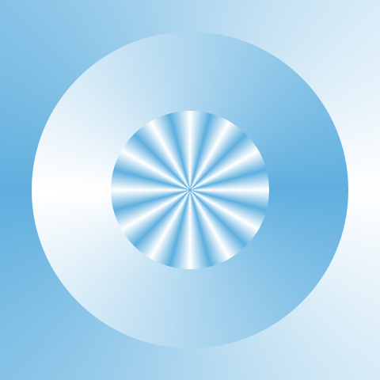
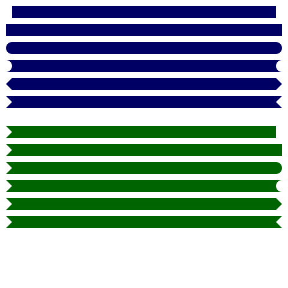
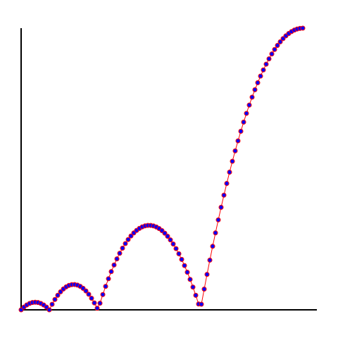

## Rebol/Blend2D `draw` dialect code examples

Using following assets:
```rebol
texture: b2d/image %assets/texture.jpeg
plan:  premultiply load %assets/Plan31.png
fish:  premultiply load %assets/fish.png
gnome: premultiply load %assets/gnome.png
text: "The quick brown fox jumps over the lazy dog. 123456780"

grid10x10: draw 20x20 [fill 215.215.215 box 0x0 10x10 box 10x10 20x20]
center:  240x240
points:  #[f64! [100 100  100 380  380 380  380 100]]
points2: skip points 2
points-in-block: [
	0x200 2x198.056 4x196.544 6x195.464 8x194.816 10x194.6 12x194.816 14x195.464 16x196.544 18x198.056
	20x200 22x196.073 24x192.628 26x189.667 28x187.188 30x185.191 32x183.677 34x182.646 36x182.098 38x182.032
	40x182.449 42x183.348 44x184.73 46x186.595 48x188.943 50x191.773 52x195.086 54x198.881 56x195.296 58x189.142
	60x183.35 62x177.922 64x172.856 66x168.154 68x163.814 70x159.838 72x156.224 74x152.974 76x150.086 78x147.562
	80x145.4 82x143.602 84x142.166 86x141.094 88x140.384 90x140.038 92x140.054 94x140.434 96x141.176 98x142.282
	100x143.75 102x145.582 104x147.776 106x150.334 108x153.254 110x156.538 112x160.184 114x164.194 116x168.566 118x173.302
	120x178.4 122x183.862 124x189.686 126x195.874 128x196.02 130x185.281 132x174.845 134x164.711 136x154.88 138x145.351
	140x136.125 142x127.201 144x118.58 146x110.261 148x102.245 150x94.531 152x87.12 154x80.011 156x73.205 158x66.701
	160x60.5 162x54.601 164x49.005 166x43.711 168x38.72 170x34.031 172x29.645 174x25.561 176x21.78 178x18.301
	180x15.125 182x12.251 184x9.68 186x7.411 188x5.445 190x3.781 192x2.42 194x1.361 196x0.605 198x0.151
	200x0
]

```
* * * *


### Text 01
```rebol
draw 480x480 [
    font %assets/NotoSans-Regular.ttf
    text 1x12  12 :text
    text 1x40  18 :text
    text 1x74  24 :text
    text 1x120 36 :text
    text 1x178 48 :text
    text 1x248 60 :text
    text 1x330 72 :text
    fill red
    text 1x444 104 :text
]
```


### Fill texture
```rebol
draw 480x480 [
    fill :texture
    circle 240x240 200
]
```


### Fill radial
```rebol
draw 480x480 [
    fill radial 255.255.255 0 95.175.223 0.5 47.95.223 1 240x240 120x120 215
    circle 240x240 200
]
```


### Fill linear
```rebol
draw 480x480 [
    fill linear 255.255.255 0 95.175.223 0.5 47.95.223 1 0x480 0x0
    fill-all
]
```


### Fill conical
```rebol
draw 480x480 [
    fill conical 255.255.255 0 95.175.223 0.5 255.255.255 1 240x240 0x240
    fill-all
]
```



### Clear
```rebol
draw 480x480 [
    fill :texture
    fill-all
    clear 100x100 380x380
]
```


### Clip
```rebol
draw 480x480 [
    line-width 10 pen black
    fill :grid10x10	fill-all
    clip 100x100 380x380
    fill :texture
    fill-all
    alpha 50%
    line 0x0 480x480
    clip off
    line 0x480 480x0
]
```


### Line join
```rebol
draw 480x480 [
    line-width 20 pen gray
    line-join miter       line 140x20   40x80  140x80
    line-join round       line 300x20  200x80  300x80
    line-join bevel       line 460x20  360x80  460x80

    line-join miter       line 140x120  40x180 140x180
    line-join miter       line 300x140 200x180 300x180
    line-join miter       line 460x150 360x180 460x180

    line-join miter round line 140x220  40x280 140x280
    line-join miter round line 300x240 200x280 300x280
    line-join miter round line 460x250 360x280 460x280

    line-join miter bevel line 140x320  40x380 140x380
    line-join miter bevel line 300x340 200x380 300x380
    line-join miter bevel line 460x350 360x380 460x380
    
    line-join miter
    line-width 1 pen black
    line 140x20   40x80 140x80
    line 300x20  200x80 300x80
    line 460x20  360x80 460x80

    line 140x120  40x180 140x180
    line 300x140 200x180 300x180
    line 460x150 360x180 460x180

    line 140x220  40x280 140x280
    line 300x240 200x280 300x280
    line 460x250 360x280 460x280

    line 140x320  40x380 140x380
    line 300x340 200x380 300x380
    line 460x350 360x380 460x380 
]
```


### Line cap
```rebol
draw 480x480 [
    pen 0.0.100
    line-width 20
    line-cap 0 line 20x20 460x20
    line-cap 1 line 20x50 460x50
    line-cap 2 line 20x80 460x80
    line-cap 3 line 20x110 460x110
    line-cap 4 line 20x140 460x140
    line-cap 5 line 20x170 460x170

    pen 0.100.0
    line-cap 5 0 line 20x220 460x220
    line-cap 5 1 line 20x250 460x250
    line-cap 5 2 line 20x280 460x280
    line-cap 5 3 line 20x310 460x310
    line-cap 5 4 line 20x340 460x340
    line-cap 5 5 line 20x370 460x370
]
```



### Line width
```rebol
draw 480x480 [
    pen 0.0.0
    line-width 1  line 10x0   470x0
    line-width 3  line 10x40  470x40
    line-width 5  line 10x80  470x80
    line-width 7  line 10x120 470x120
    line-width 9  line 10x160 470x160
    line-width 11 line 10x200 470x200
    line-width 13 line 10x240 470x240
    line-width 15 line 10x280 470x280
    line-width 17 line 10x320 470x320
    line-width 19 line 10x360 470x360
    line-width 21 line 10x400 470x400
    line-width 23 line 10x440 470x440
    line-width 25 line 10x480 470x480
]
```


### Polygon
```rebol
draw 480x480 [
    pen 200.60.60 line-width 4
    fill 200.200.200.100
    polygon 10x10 470x10 470x470 10x470 
    fill off
    polygon 10x10 240x100 470x10 380x240 470x470 240x380 10x470 100x240
    fill 255.0.0 
    polygon 10x10 240x200 470x10 280x240 470x470 240x280 10x470 200x240
]
```


### Polygon translate join
```rebol
draw 480x480 [
    pen red fill-pen orange
    line-width 10 line-join round
    translate 10x0
    polygon 50x100 50x200 150x100 150x200
    translate 130x0 line-join miter
    polygon 50x100 50x200 150x100 150x200
    translate 130x0 line-join bevel
    polygon 50x100 50x200 150x100 150x200
]
```


### Polygon translate
```rebol
draw 480x480 [
    line-width 3
    pen red
    reset-matrix
    scale 1.5
    translate 100x100
    polygon 50x5 62x40 95x40 68x60 80x95 50x74 20x95 32x60 5x40 38x40

    reset-matrix        
    translate 100x100
    polygon 50x5 62x40 95x40 68x60 80x95 50x74 20x95 32x60 5x40 38x40

    reset-matrix
    scale .5
    translate 100x100
    polygon 50x5 62x40 95x40 68x60 80x95 50x74 20x95 32x60 5x40 38x40

    reset-matrix
    scale .2
    translate 100x100
    polygon 50x5 62x40 95x40 68x60 80x95 50x74 20x95 32x60 5x40 38x40

    reset-matrix
    pen blue
    polygon 50x5 62x40 95x40 68x60 80x95 50x74 20x95 32x60 5x40 38x40
]
```


### Image alpha
```rebol
draw 480x480 [
    alpha 30%
    image :texture 0x0
    alpha 100%
    image :texture 40x40 400x400
]
```


### Image scale rotate
```rebol
draw 480x480 [
                        image :plan 00x100
    scale 0.8 rotate 10 image :plan 50x100
    scale 0.8 rotate 10 image :plan 50x100
    scale 0.8 rotate 10 image :plan 50x100
    scale 0.8 rotate 10 image :plan 50x100
]
```


### Image blend 1
```rebol
draw 480x480 [
    clear-all
    scale 0.5
    translate 30x30
    blend 'source-copy      image :fish  0x0
    blend 'source-over      image :gnome 0x0
    translate 140x0
    blend 'source-copy      image :fish  0x0
    blend 'source-copy      image :gnome 0x0
    translate 140x0
    blend 'source-copy      image :fish  0x0
    blend 'source-in        image :gnome 0x0

    translate -280x140
    blend 'source-copy      image :fish  0x0
    blend 'source-out       image :gnome 0x0
    translate 140x0
    blend 'source-copy      image :fish  0x0
    blend 'source-atop      image :gnome 0x0
    translate 140x0
    blend 'source-copy      image :fish  0x0
    blend 'destination-over image :gnome 0x0

    translate -280x140
    blend 'source-copy      image :fish  0x0
    blend 'destination-in   image :gnome 0x0
    translate 140x0
    blend 'source-copy      image :fish  0x0
    blend 'destination-out  image :gnome 0x0
    translate 140x0
    blend 'source-copy      image :fish  0x0
    blend 'destination-atop image :gnome 0x0
]
```


### Image blend 2
```rebol
draw 480x480 [
    clear-all
    scale 0.5
    translate 30x30
    blend 'source-copy      image :fish  0x0
    blend 'xor              image :gnome 0x0
    translate 140x0
    blend 'source-copy      image :fish  0x0
    blend 'plus            image :gnome 0x0
    translate 140x0
    blend 'source-copy      image :fish  0x0
    blend 'minus             image :gnome 0x0

    translate -280x140
    blend 'source-copy      image :fish  0x0
    blend 'modulate         image :gnome 0x0
    translate 140x0
    blend 'source-copy      image :fish  0x0
    blend 'multiply         image :gnome 0x0
    translate 140x0
    blend 'source-copy      image :fish  0x0
    blend 'screen           image :gnome 0x0

    translate -280x140
    blend 'source-copy      image :fish  0x0
    blend 'overlay          image :gnome 0x0
    translate 140x0
    blend 'source-copy      image :fish  0x0
    blend 'darken           image :gnome 0x0
    translate 140x0
    blend 'source-copy      image :fish  0x0
    blend 'lighten          image :gnome 0x0
]
```


### Image blend 3
```rebol
draw 480x480 [
    clear-all
    scale 0.5
    translate 30x30
    blend 'source-copy      image :fish  0x0
    blend 'color-dodge      image :gnome 0x0
    translate 140x0
    blend 'source-copy      image :fish  0x0
    blend 'color-burn       image :gnome 0x0
    translate 140x0
    blend 'source-copy      image :fish  0x0
    blend 'linear-burn      image :gnome 0x0

    translate -280x140
    blend 'source-copy      image :fish  0x0
    blend 'linear-light     image :gnome 0x0
    translate 140x0
    blend 'source-copy      image :fish  0x0
    blend 'pin-light        image :gnome 0x0
    translate 140x0
    blend 'source-copy      image :fish  0x0
    blend 'hard-light       image :gnome 0x0

    translate -280x140
    blend 'source-copy      image :fish  0x0
    blend 'soft-light       image :gnome 0x0
    translate 140x0
    blend 'source-copy      image :fish  0x0
    blend 'difference       image :gnome 0x0
    translate 140x0
    blend 'source-copy      image :fish  0x0
    blend 'exclusion        image :gnome 0x0
]
```


### Box rotate
```rebol
draw 480x480 [
    fill 200.0.0.100 pen 0.0.0.100 line-width 10
    box 20x20 440x440
    rotate 45 240x240
    box 20x20 440x440
    reset-matrix
    box 100x100 280x280
]
```


### Ellipse
```rebol
draw 480x480 [
    line-width 4
    pen 200.60.60 
    ellipse 10x10  460x460
    ellipse 10x100 460x280
    ellipse 10x200 460x80
    pen 60.60.200 
    ellipse 100x10 280x460
    ellipse 200x10 80x460
]
```


### Point
```rebol
draw 480x480 [
    line-width 4
    pen  red
    fill orange
    point-size 30
    point :center ; single point

    line-width 0
    fill blue
    point-size 20
    point :points ; multiple points from vector value

    point-size 10
    fill purple
    point 240x350 ; 
    
    point-size 4
    fill black
    point 230x360 240x360 250x360 240x370 ; multiple points
]
```


### Graph
```rebol
draw 480x480 [
    translate 15x20
    scale 2
    ;; axis
    line-width 1 pen
    line 0x0 0x200 210x200  ;; axis
    ;; graph
    line-width 0.5 pen red
    line  :points-in-block
    fill blue
    point-size 3
    point :points-in-block
]
```



### Triangle
```rebol
draw 480x480 [
    line-width 4
    ; single triangle
    pen  red
    fill orange
    triangle 100x100 100x380 380x380
    ; two triangles using raw pairs
    pen  off
    fill olive
    triangle 370x100 110x100 240x230  380x110 380x370 250x240

    ; triangle from a vector value
    fill 200.100.100.100
    triangle :points2
]
```


### Arc
```rebol
draw 480x480 [
    line-width 4
    pen 200.60.60 
    arc 240x240 100x100 0 240 pie
    line-width 6
    arc 240x240 150x150 0 240
    line-width 8 
    arc 240x240 200x200 0 240 chord
]
```


### Cubic
```rebol
draw 480x480 [
    pen 200.60.60 line-width 4
    cubic 10x470 100x10 380x470 470x10 
    pen 60.60.200 line-width 4.0
    cubic 470x10 10x100 470x380 10x470
]
```


### Shape 1
```rebol
draw 480x480 [
    fill :grid10x10	fill-all
    pen 200.60.60 line-width 10
    shape [
    	move 100x300 arc  380x300 100 150 0 sweep close
    	move 100x330 line 380x330
    ]
]
```


### Shape 2
```rebol
; preprocessed shape path
my-shape: b2d/path [
    move 100x300 arc  380x300 100 150 0 sweep close
    move 100x330 line 380x330
]
```
```rebol
== #[handle! BLPath]
```

```rebol
draw 480x480 [
    fill :grid10x10	fill-all
    ; drawing shape with some semitransparent fill
    fill 10.10.10.100
    pen 200.60.60 line-width 10
    shape :my-shape
    ; and again with different stroke color and width 
    pen 60.60.200 line-width 5
    ; translated a little bit down
    translate 0x50
    shape :my-shape
]
```


### Shape arc
```rebol
draw 480x480 [
    line-width 10
    line-join  miter round
    line-cap   2
    pen orange shape [move 100x200 arc 380x200 220 100 0]
    pen green  shape [move 100x200 arc 380x200 220 100 0 large]
    pen blue   shape [move 100x200 arc 380x200 220  50 0 sweep]
    pen red    shape [move 100x200 arc 380x200 220  50 0 sweep large]
    ; complex shape:
    pen black
    shape [
    	move 0x399
    	line 42x357
    	arc 84x315 25 20 -45 sweep
    	line 126x273
    	arc  168x231 25 40 -45 sweep
    	line 210x189
    	arc  252x147 25 60 -45 sweep
    	line 294x105
    	arc  336x63 25 80 -45 sweep
    	line 399x0
    	move 0x0
    ]
]
```


### Shape curve
```rebol
draw 480x480 [
    ; A cubic Bézier curve is defined by a start point, an end point, and two control points.
    line-width 2 pen black
    shape [
    	move 0x0   curve 0x480 480x480 480x0
    	move 0x480 curve 0x0   480x0   480x480
    ]
    ; and a shape with multiple curves using just one keyword
    
    line-width 10
    line-cap   2
    line-join  miter round
    pen red
    shape [
    	move  100x50
    	curve 100x450 380x450 380x50  300x250 180x250 100x50
    ]
    ; Control points and lines for the red path:
    pen 0.0.0.100
    line-width 2
    line 100x50 100x450
    line 380x50 380x450
    line 100x50 180x250
    line 380x50 300x250
    pen off fill 0.0.200.200
    point-size 16 point 100x50 100x450 380x450 380x50 300x250 180x250
]
```


### Shape curv
```rebol
draw 480x480 [
    line-width 10
    line-join  miter round
    line-cap   2
    pen red
    shape [
    	move 100x100
    	vline 380
    	curv 380x380 380x100
    ]
    ; Control points and lines for the curved path:
    pen 0.0.0.100
    line-width 2
    line 100x380 380x380 380x100
    pen off fill 0.0.200.200
    point-size 16 point 100x380 380x380 380x100
]
```


### Shape qcurve
```rebol
draw 480x480 [
    line-width 10
    line-join  miter round
    line-cap   2
    pen red
    shape [
    	move 100x50	qcurve 240x430 380x50
    ]
    pen orange line-width 3
    shape [
    	move 0x240 line 240x240 qcurve 480x240 480x0
    ]
    ; Control points and lines for the red path:
    pen 0.0.0.100
    line-width 2
    line 100x50 240x430 380x50
    pen off fill 0.0.200.200
    point-size 16 point 100x50 240x430 380x50
]
```


### Shape qcurv
```rebol
draw 480x480 [
    line-width 10
    line-join  miter round
    line-cap   2
    pen red
    shape [
    	move     0x240
    	qcurve 120x450 240x240
    	qcurv  480x240
    ]
    pen blue line-width 5
    shape [
    	move 0x240
    	qcurve 60x-80 120x240
    	qcurv 240x240 360x240 480x240 
    ]
    ; Control points:
    pen off fill 0.0.200.200
    point-size 16 point 0x240 240x240 480x240
]
```


### Shape hline vline
```rebol
draw 480x480 [
    line-width 10
    line-join  miter round
    line-cap   2
    pen red
    shape [
    	move 100x100 hline 380
    	move 100x150 hline 280
    	move 100x200 hline 180
    ]
    pen blue
    shape [
    	move 380x100 vline 380
    	move 280x150 vline 280
    	move 180x200 vline 180
    ]
]
```


### Img pattern pad
```rebol
draw 480x480 [
    scale 50%
    fill :texture 'pad
    fill-all
]
```


### Img pattern tile
```rebol
draw 480x480 [
    scale 31%
    fill :texture 'tile
    fill-all
]
```


### Img pattern flip
```rebol
draw 480x480 [
    scale 31%
    fill :texture 'flip
    fill-all
]
```


### Img pattern tile y
```rebol
draw 480x480 [
    scale 31%
    fill :texture 'tile-y
    fill-all
]
```


### Img pattern flip y
```rebol
draw 480x480 [
    scale 31%
    fill :texture 'flip-y
    fill-all
]
```


### Img pattern tile x
```rebol
draw 480x480 [
    scale 31%
    fill :texture 'tile-x
    fill-all
]
```


### Img pattern tile x flip y
```rebol
draw 480x480 [
    scale 31%
    fill :texture 'tile-x-flip-y
    fill-all
]
```


### Img pattern flip x
```rebol
draw 480x480 [
    scale 31%
    fill :texture 'flip-x
    fill-all
]
```


### Img pattern flip x tile y
```rebol
draw 480x480 [
    scale 31%
    fill :texture 'flip-x-tile-y
    fill-all
]
```


* * * *
This file was generated using [examples.r3](examples.r3) script.
